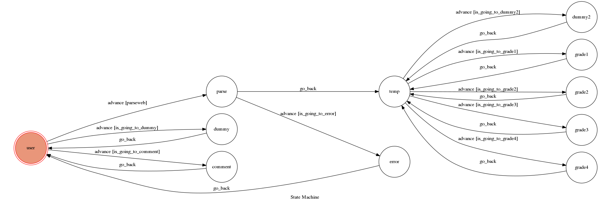

# TOC Project 2017

A telegram bot based on a finite state machine
course parsing bot 利文韡 F74032162 Andrewli_bot
首先會先爬成大課程查詢的網頁（資訊系課程）
然後將資訊系的必選修分成大一大二大三大四
在依據使用者輸入去判斷要給哪個年級的資訊


## Setup

### Prerequisite
* Python 3

#### Install Dependency
```sh
pip install -r requirements.txt
```

### ROBOT
```
@Andrewli_bot
```

### Secret Data

`API_TOKEN` and `WEBHOOK_URL` in app.py **MUST** be set to proper values.
Otherwise, you might not be able to run your code.

### Run Locally
You can either setup https server or using `ngrok` as a proxy.

**`ngrok` would be used in the following instruction**

```sh
ngrok http 5000
```

After that, `ngrok` would generate a https URL.

You should set `WEBHOOK_URL` (in app.py) to `your-https-URL/hook`.

#### Run the sever

```sh
python3 app.py
```

## Finite State Machine


## Usage
The initial state is set to `user`.

Every time `user` state is triggered to `advance` to another state, it will `go_back` to `user` state after the bot replies corresponding message.

* user

 * comment
     * Input: 'comment'
         * Reply: "推薦課程...."
 * parse
     * Input: "parse"
         * Reply: "parsing complete"
* dummy

* temp

* grade1
   * Input: "grade1"
       * Reply: "result..."
* grade2
   * Input: "grade2"
       * Reply: "result..."
* grade3
   * Input: "grade3"
       * Reply: "result..."
* grade4
   * Input: "grade4"
       * Reply: "result..."
* dummy2
   * Input: any other string
       * Reply: "choose command:\ngrade1\ngrade2\ngrade3\ngrade4\n"

## Author
利文韡


